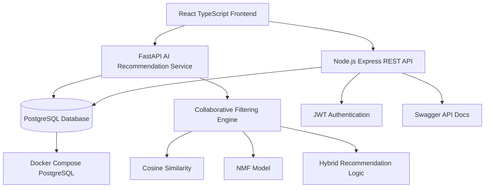
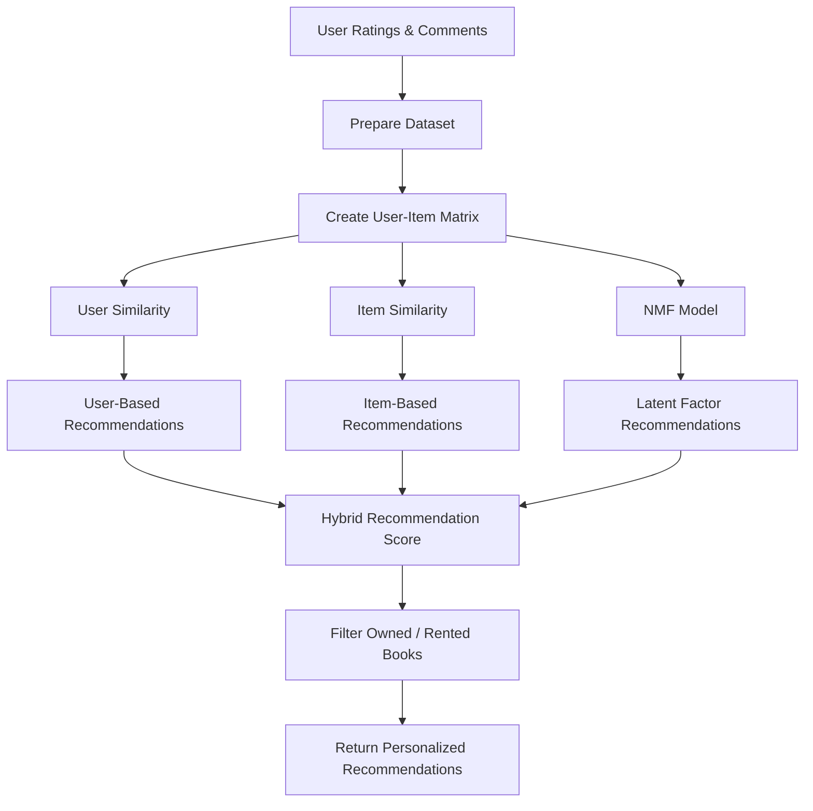
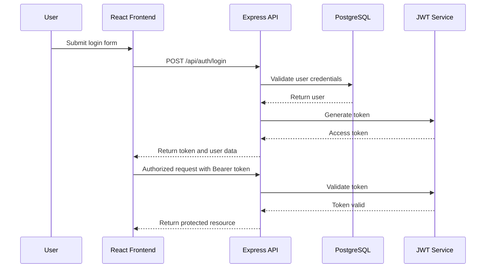
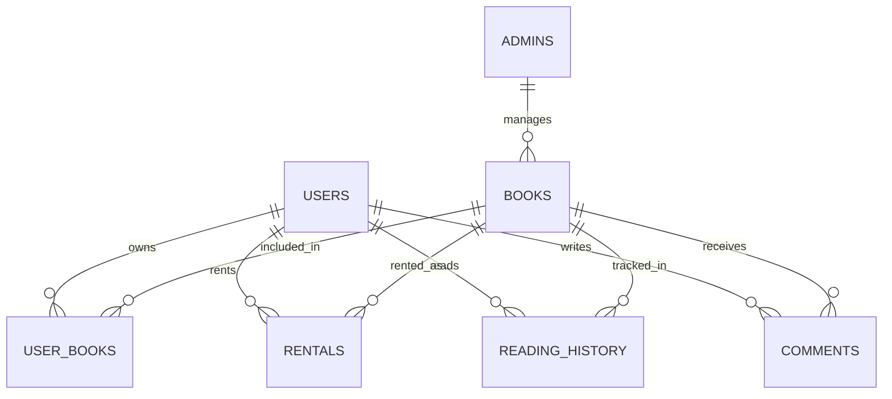

\

# Bookflix

**AI-Powered Digital Library, Book Rental & Reading Platform**

Bookflix is a full-stack digital library platform that allows users to browse books, rent or purchase books, manage their personal library, read PDF books, access audio books, leave reviews, and receive AI-powered book recommendations.

The project consists of a React TypeScript frontend, a Node.js Express REST API, a PostgreSQL database, and a separate FastAPI-based recommendation service powered by collaborative filtering.

---

## ✨ Key Features

* 📚 Book browsing, search, pagination, and category filtering
* 🔐 JWT-based user authentication
* 👤 User profile and subscription management
* 🛒 Shopping cart and simulated payment flow
* 📖 Personal library management
* 🎧 Audio book access control
* 📄 PDF reading support
* ⭐ Book comments and rating system
* 🤖 AI-powered personalized book recommendations
* 🧠 Collaborative filtering recommendation service
* 🛠️ Admin dashboard for managing books, users, comments, and subscriptions
* 📄 Swagger / OpenAPI documentation for backend APIs
* 🐳 PostgreSQL database setup with Docker Compose

---

## 📸 Screenshots

Add screenshots here after uploading them to GitHub.

Recommended order:

* Login / Register
* Home / Book List
* Book Detail
* My Library
* Recommendations
* Admin Dashboard

---

## 🏗️ Architecture



---

## 🤖 Recommendation System Flow



---

## 🔐 Authentication Flow



---

## 🗄️ Simplified Data Model



---

## 🛠️ Tech Stack

### Frontend

* React
* TypeScript
* Vite
* Material UI
* React Router
* Axios
* Context API
* Redux Toolkit

### Backend

* Node.js
* Express.js
* PostgreSQL
* JWT Authentication
* bcrypt
* Swagger / OpenAPI
* CORS

### AI Service

* Python
* FastAPI
* SQLAlchemy
* pandas
* NumPy
* scikit-learn
* joblib
* Collaborative Filtering
* Cosine Similarity
* Non-negative Matrix Factorization

### Database & Infrastructure

* PostgreSQL
* Docker Compose
* SQL migrations
* Seed data

---

## 📂 Project Structure

### 🎨 Frontend (`frontend/`)

React TypeScript application responsible for:

* Authentication pages
* Book listing and filtering
* Book detail pages
* Shopping cart
* Payment simulation
* Personal library
* PDF and audio book access
* Recommendation page
* User profile
* Admin UI

---

### 🌐 Backend API (`backend/`)

Node.js Express REST API responsible for:

* User authentication
* Book management
* Category management
* Rental operations
* Reading progress
* User library management
* Comment and rating operations
* Subscription management
* Admin operations
* Swagger API documentation

---

### 🤖 AI Service (`ai_service/`)

FastAPI service responsible for:

* Training recommendation models
* Preparing user-book rating data
* Creating user-item matrices
* Calculating user and item similarity
* Generating personalized recommendations
* Handling cold-start recommendation cases

---

## 🌐 REST API Overview

### Authentication

* User register
* User login
* Forgot password
* Reset password

### Books

* List books
* Get book detail
* Filter books by category
* Rent book
* Update reading progress
* Check audio access

### Users

* Get profile
* Update profile
* Get user library
* Add books to library
* Remove books from library
* Manage subscription

### Comments

* Add comment
* Get book comments
* Get user comments
* Delete comment

### Admin

* Admin login
* Add, update, delete books
* Manage users
* Manage comments
* Manage subscriptions
* View dashboard statistics

Interactive API documentation is available through Swagger after running the backend:

`http://localhost:5000/api-docs`

---

## 🤖 AI API Overview

The AI recommendation service exposes endpoints for model training and personalized recommendations.

### Main Endpoints

* `POST /ai/train`
* `GET /ai/similar-users-recommendations/{user_id}`

FastAPI documentation is available after running the AI service:

`http://localhost:8000/docs`

---

## 🚀 Roadmap

### ✅ Completed

* React TypeScript frontend
* Express REST API
* PostgreSQL schema
* JWT authentication
* User profile management
* Book listing and filtering
* Personal library
* Cart and payment simulation
* Comment and rating system
* Admin dashboard
* Swagger documentation
* FastAPI AI recommendation service
* Collaborative filtering recommendation logic

### 🚧 In Progress

* Repository cleanup
* README and documentation improvements
* Better installation documentation
* Screenshots and demo media
* API documentation separation

### 🔮 Planned

* Production deployment
* CI/CD pipeline
* Improved recommendation explanations
* Better admin analytics
* More advanced search and filtering
* Cloud storage for PDF and audio assets
* Role-based authorization improvements
* Unit and integration tests

---

## ⚙️ Local Development

### Backend

```bash
cd backend
npm install
npm run dev
```

Backend runs on:

`http://localhost:5000`

Swagger documentation:

`http://localhost:5000/api-docs`

---

### Frontend

```bash
cd frontend
npm install
npm run dev
```

Frontend runs on:

`http://localhost:5173`

---

### AI Service

```bash
cd ai_service
pip install -r requirements.txt
uvicorn main:app --reload --port 8000
```

AI service runs on:

`http://localhost:8000`

FastAPI documentation:

`http://localhost:8000/docs`

---

### PostgreSQL with Docker Compose

```bash
cd backend
docker compose up -d
```

This starts a PostgreSQL database and loads the initial schema and seed data.

---

## 🔮 Future Vision

Bookflix aims to become a complete digital reading platform that combines book discovery, personal library management, subscription-based access, digital reading, audio books, and AI-powered recommendations.

The long-term goal is to improve the reading experience by helping users discover relevant books based on their interests, reading history, and community ratings.
